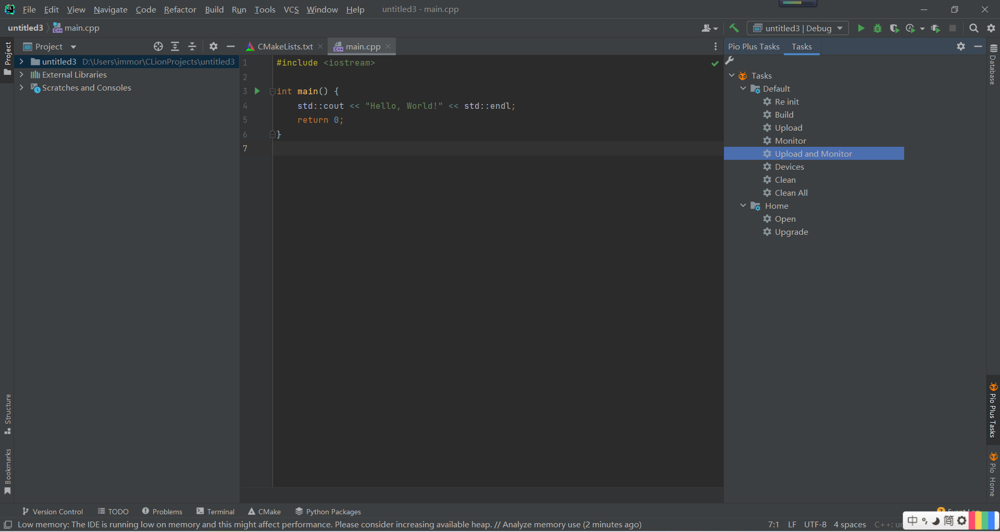
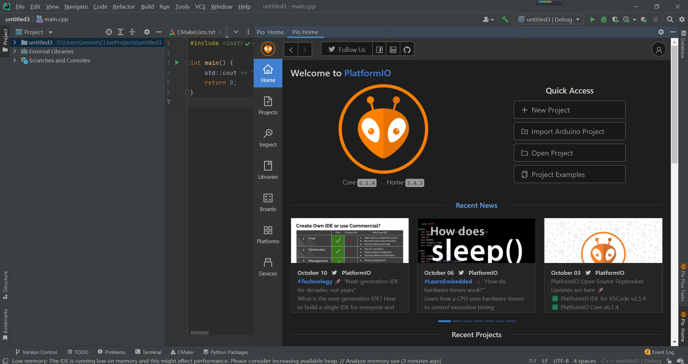

# clion-platformio-plus
clion platformio 插件增强

只有周末有空写一写，加上可能需要休息或者有其他事情，可能需要好几个月才能发布一个release。

已有的界面如下，已经把基础树绘制完成，platformio home也可以嵌入clion.

现在准备将Tasks栏下增加工具栏用于跳转到设置platformio路径的界面。

下一步就是通过树调用pio二进制文件。